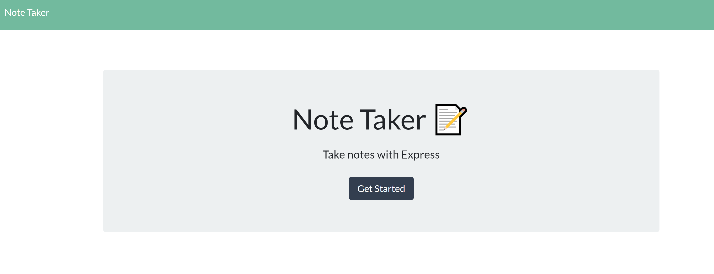
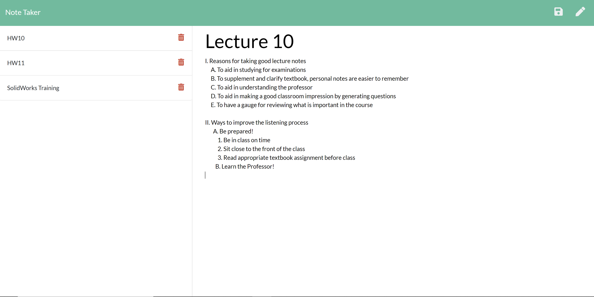

# Note-Taker

# Note Taker

## Description

Note Taker is an application that allows a user to create notes. The user creates a title for each of their notes and then fill each note with text. The user can then view their notes by clicking on them in the list. The user is also able to delete them.

## Table of contents

- [Description](#Description)
- [Installation](#Installation)
- [Usage](#Usage)
- [License](#License)
- [Contributors](#Contributors)
- [Test](#Test)
- [GitHub Info](#Questions)

## Links

- [Note Taker Website](https://salty-reaches-23955.herokuapp.com/)

## Installation

No installation required, its a web application.

## Usage

This application assist the user in creating notes.

Screenschot

## License

## Contributors

No contributing guidelines

## Test

No test required

## Questions

For questions contact ooledezma@gmail.com.
GitHub URL: https://api.github.com/users/ooledezma
